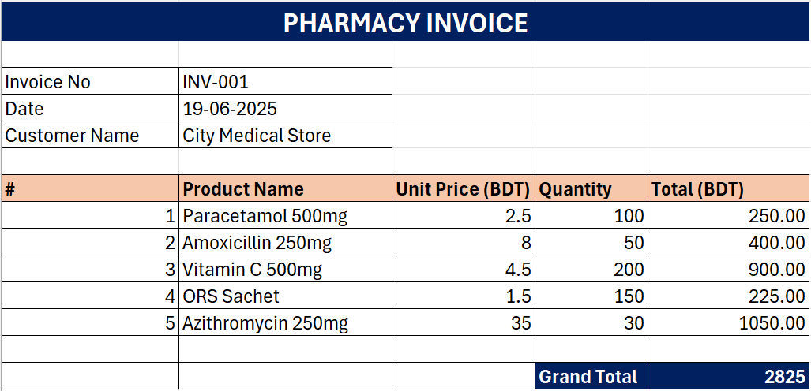

# 💊 Smart Pharmacy Invoice System — Excel Mini Project

A self-made Excel-based invoice system built for a pharmacy use case. This mini project demonstrates how Excel formulas and data validation can be combined to create a functional, automated invoicing tool — no VBA or macros required.

---

## 📌 Project Overview

Manual invoice creation is time-consuming and error-prone. This project simulates a smart invoicing solution where a pharmacist simply selects a medicine from a dropdown, enters the quantity, and the system automatically fills the unit price and calculates the total — instantly. It was built as a mini portfolio project to demonstrate practical, real-world Excel skills beyond basic data entry.

---

## 🖼️ Invoice Preview

---

## 🧾 Invoice Structure

| Field | Detail |
|-------|--------|
| Invoice No | Auto-labeled (e.g. INV-001) |
| Date | Manually entered |
| Customer Name | Manually entered |
| Product Selection | Dropdown from medicine list |
| Unit Price | Auto-filled via XLOOKUP |
| Quantity | Manually entered |
| Row Total | Auto-calculated (Quantity × Price) |
| Grand Total | Auto-summed from all rows |
| Currency | BDT (Bangladeshi Taka) |

---

## ⚙️ How It Works

**Step 1 — Select a Medicine**
Each product row has a dropdown list powered by Data Validation. The pharmacist simply selects a medicine name from the list — no manual typing required.

**Step 2 — Price Auto-Fills**
The moment a product is selected, XLOOKUP looks it up in the medicine reference list and automatically pulls the correct unit price into the row.

**Step 3 — Total Calculates Instantly**
An IF formula checks whether a product has been selected. If yes, it multiplies Quantity × Unit Price to give the row total. If no product is selected, the cell stays blank — keeping the invoice clean.

**Step 4 — Grand Total Updates Automatically**
A SUM formula at the bottom adds up all row totals and displays the Grand Total instantly.

---

## 🧪 Sample Invoice Data

| # | Product Name | Unit Price (BDT) | Quantity | Total (BDT) |
|---|-------------|-----------------|----------|-------------|
| 1 | Paracetamol 500mg | 2.5 | 100 | 250.00 |
| 2 | Amoxicillin 250mg | 8.0 | 50 | 400.00 |
| 3 | Vitamin C 500mg | 4.5 | 200 | 900.00 |
| 4 | ORS Sachet | 1.5 | 150 | 225.00 |
| 5 | Azithromycin 250mg | 35.0 | 30 | 1050.00 |
| | | | **Grand Total** | **2825.00** |

---

## 🛠️ Excel Skills & Features Used

| Feature | Purpose |
|---------|---------|
| `XLOOKUP` | Auto-fills unit price based on selected product |
| `Data Validation (Dropdown)` | Product selection from medicine list |
| `IF Formula` | Keeps total cells blank when no product is selected |
| `SUM Formula` | Calculates grand total from all row totals |
| `Excel Formatting` | Dark navy header, branded salmon row colors, bold totals |

---

## 💡 Key Learnings

- How to combine XLOOKUP with dropdown lists for automated data retrieval   
- Using IF formulas to keep a sheet clean and professional when fields are empty   
- Designing a print-ready invoice layout in Excel with professional formatting   
- Building a functional tool that solves a real business problem using only core Excel features   

---

## 🚀 How to Use

1. Download the `Smart-Pharmacy-Invoice-System.xlsx` file   
2. Open it in Microsoft Excel   
3. Fill in Invoice No, Date, and Customer Name   
4. In each product row, click the dropdown and select a medicine   
5. Enter the quantity — price and total fill automatically   
6. Grand Total updates instantly at the bottom   

---

## 👤 Author

**Md. Sirajul Islam**   
📎 [linkedin.com/in/md-sirajul-islam57](https://linkedin.com/in/md-sirajul-islam57)   
🐙 [github.com/sirajul-islam5](https://github.com/sirajul-islam5)   

---

> *This is a mini project created for learning purpose.*
